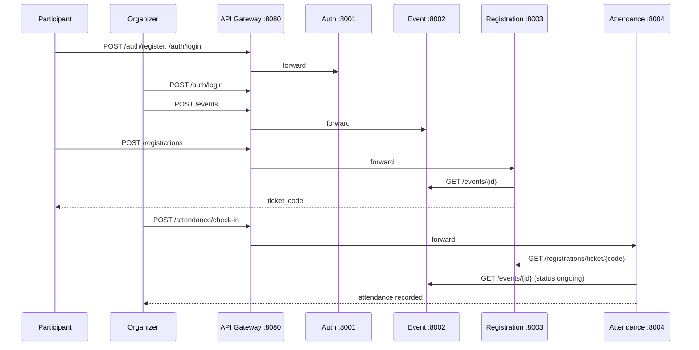

# KampusEvent — Integration Guide

Panduan integrasi seluruh microservices KampusEvent.

## Arsitektur Decomposition

**Coarse-grained** — 4 service per **business capability** (bukan fine-grained):

| Service | Bounded Context |
|---------|-----------------|
| Auth | Identity & access |
| Event | Event catalog & lifecycle |
| Registration | Enrollment & ticketing |
| Attendance | Check-in & presence |

## Arsitektur Integrasi



## Service Communication Map

| From | To | Endpoint | Purpose |
|------|-----|----------|---------|
| Registration | Event | `GET /events/{id}` | Validasi event, status `upcoming`, kuota, kepemilikan |
| Attendance | Registration | `GET /registrations/ticket/{code}` | Validasi tiket (wajib `X-Internal-API-Key`) |
| Attendance | Event | `GET /events/{id}` | Validasi status `ongoing` + organizer ownership |

**Tidak ada HTTP call ke Auth Service** dari service lain. JWT divalidasi **lokal** dengan shared `JWT_SECRET`.

**Aturan:** Tidak ada akses langsung ke database service lain.

## Business Rules (Status Event)

| Status efektif | Registrasi | Check-in |
|----------------|------------|----------|
| `upcoming` | ✅ | ❌ |
| `ongoing` | ❌ | ✅ |
| `completed` | ❌ | ❌ |
| `inactive` / `cancelled` | ❌ | ❌ |

Event response memuat:
- `manual_status` — disimpan di DB (`active`, `inactive`, `cancelled`)
- `status` — dihitung dari jadwal (`starts_at`, `ends_at`) + `manual_status`

## Service-to-Service Authentication

| Endpoint | Header | Env Var |
|----------|--------|---------|
| `GET /registrations/ticket/{code}` | `X-Internal-API-Key: <key>` | `INTERNAL_API_KEY` |

Attendance Service otomatis mengirim header ini. Nilai harus **sama** di Registration & Attendance (`docker-compose.yml`).

## Authorization Rules

| Aksi | Siapa | Aturan |
|------|-------|--------|
| Update/delete event | Organizer | Hanya `created_by == user_id` |
| Update/delete event | Admin | Semua event |
| List registrasi | Organizer | Wajib `?event_id=` + verifikasi kepemilikan event |
| List registrasi | Admin | Semua (opsional filter `event_id`) |
| Check-in / batalkan check-in | Organizer | Hanya event miliknya |
| Check-in / batalkan check-in | Admin | Semua event |
| User lookup (`POST /auth/users/lookup`) | Organizer/Admin | Resolve nama peserta |
| Assign role (`PATCH /auth/users/{id}/role`) | Admin | Tidak bisa ubah role sendiri |

## Menjalankan Full Stack

```bash
cd kampusevent-infrastructure
cp .env.example .env
docker compose up --build
```

Frontend (terminal terpisah):

```bash
cd kampusevent-frontend
npm install && cp .env.example .env && npm run dev
```

Tunggu semua container healthy:

```bash
docker compose ps
```

## API Gateway (Port 8080)

```
Client → API Gateway :8080 → Microservice
              ↓
         Rate Limiting + CORS (credentials)
```

### Routing

| Gateway URL | Forward ke | Contoh |
|-------------|------------|--------|
| `http://localhost:8080/auth/*` | Auth :8001 | `/auth/login`, `/auth/refresh` |
| `http://localhost:8080/events` | Event :8002 | `/events`, `/events/{id}` |
| `http://localhost:8080/registrations` | Registration :8003 | `/registrations` |
| `http://localhost:8080/attendance` | Attendance :8004 | `/attendance/check-in` |
| `http://localhost:8080/gateway/health` | Gateway | health check |

Komunikasi antar service (internal) langsung via Docker network — gateway hanya untuk traffic eksternal.

### Rate Limiting

| Zone | Limit | Endpoint | Response |
|------|-------|----------|----------|
| `api_general` | 100 req/s (burst 50) | events, registrations, attendance | HTTP 429 |
| `api_auth` | 10 req/s (burst 20) | `/auth/*` (kecuali login/register) | HTTP 429 |
| `api_auth_strict` | 60 req/min (burst 15) | `/auth/login`, `/auth/register` | HTTP 429 |

## Akun Development (Seed)

| Email | Password | Role |
|-------|----------|------|
| admin@campus.edu | admin123 | admin |
| organizer@campus.edu | organizer123 | organizer |
| participant@campus.edu | participant123 | participant |

## Skenario Manual Lengkap (via Gateway)

### 1. Login Organizer

```http
POST http://localhost:8080/auth/login
Content-Type: application/json

{"email": "organizer@campus.edu", "password": "organizer123"}
```

Response: `access_token` + refresh token di httpOnly cookie.

### 2. Buat Event (Akan Datang)

```http
POST http://localhost:8080/events
Authorization: Bearer <organizer_token>
Content-Type: application/json

{
  "title": "Seminar Microservices",
  "description": "Workshop arsitektur",
  "starts_at": "2026-12-15T09:00:00Z",
  "ends_at": "2026-12-15T17:00:00Z",
  "location": "Aula Kampus",
  "quota": 50,
  "status": "active"
}
```

Response `status` efektif: `upcoming` (jika waktu sekarang < `starts_at`).

### 3. Participant Daftar

```http
POST http://localhost:8080/auth/login
{"email": "participant@campus.edu", "password": "participant123"}

POST http://localhost:8080/registrations
Authorization: Bearer <participant_token>
{"event_id": "<event_id>"}
```

Response berisi `ticket_code` e.g. `EVT-2026-ABCD1234`. QR di-generate di frontend dari kode ini.

### 4. Check-In (Event Harus Berlangsung)

Ubah jadwal event agar `ongoing` (organizer PUT), atau tunggu waktu `starts_at`:

```http
PUT http://localhost:8080/events/<event_id>
Authorization: Bearer <organizer_token>
{"starts_at": "2026-06-07T08:00:00Z", "ends_at": "2026-06-07T18:00:00Z"}

POST http://localhost:8080/attendance/check-in
Authorization: Bearer <organizer_token>
{"ticket_code": "EVT-2026-ABCD1234"}
```

### 5. Batalkan Check-In (Opsional)

```http
DELETE http://localhost:8080/attendance/<attendance_id>
Authorization: Bearer <organizer_token>
```

### 6. Lihat Kehadiran

```http
GET http://localhost:8080/attendance?event_id=<event_id>
Authorization: Bearer <organizer_token>
```

## Observability

| Tool | URL | Fungsi |
|------|-----|--------|
| Prometheus | http://localhost:9090 | Metrics scraping |
| Grafana | http://localhost:3000 | RED dashboard (admin/admin) |
| Jaeger | http://localhost:16687 | Distributed tracing |

## Testing

### E2E & Integration (Infrastructure)

```bash
cd e2e-tests
pip install -r requirements.txt
pytest -v
```

**19 tests** — full flow, phase 1–3, contract, gateway, observability.

### Unit & Integration (Per Service)

```bash
cd kampusevent-auth-service && pytest          # 13
cd kampusevent-event-service && pytest         # 13
cd kampusevent-registration-service && pytest  # 12
cd kampusevent-attendance-service && pytest    # 12
```

**Total: 69 tests** (50 service + 19 E2E).

## Environment Variables

Shared via `kampusevent-infrastructure/.env`:

| Variable | Deskripsi |
|----------|-----------|
| `JWT_SECRET` | Harus sama di semua service |
| `INTERNAL_API_KEY` | Shared key Registration ↔ Attendance |
| `SEED_USERS` | `true` untuk akun development |
| `E2E_*_URL` | URL untuk E2E tests (default: gateway) |

## Database Migrations

Setiap service menjalankan `alembic upgrade head` saat container startup.

Fresh start (reset semua data):

```bash
docker compose down -v
docker compose up --build
```

## Troubleshooting

| Masalah | Solusi |
|---------|--------|
| Service unhealthy | `docker compose logs <service-name>` |
| 401 Unauthorized | Token expired — refresh via cookie atau login ulang |
| 400 check-in / registration | Cek status efektif event (`upcoming` vs `ongoing`) |
| 503 service unavailable | Service dependency belum up, cek logs |
| CORS dari browser | Pakai Vite proxy (dev) atau gateway CORS headers |
| Prometheus target down | Tunggu healthcheck, restart stack |

## Definition of Done — Integrasi

- [x] Docker Compose menjalankan semua service
- [x] Database per service terisolasi
- [x] Komunikasi antar service via HTTP only
- [x] Prometheus scrape semua `/metrics`
- [x] Grafana RED dashboard tersedia
- [x] Jaeger menerima traces (OTLP)
- [x] E2E full flow lulus
- [x] Contract tests lulus
- [x] Resilience pattern (timeout, retry, fallback)
- [x] Service-to-service auth (`INTERNAL_API_KEY`)
- [x] Resource ownership enforcement
- [x] Event schedule & effective status rules
- [x] Alembic migrations on startup
- [x] Frontend terintegrasi via gateway
