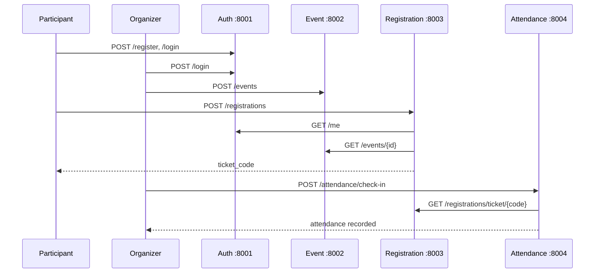

# KampusEvent — Integration Guide

Panduan integrasi seluruh microservices KampusEvent.

## Arsitektur Integrasi



## Service Communication Map

| From | To | Endpoint | Purpose |
|------|-----|----------|---------|
| Registration | Auth | `GET /me` | Validasi JWT participant |
| Registration | Event | `GET /events/{id}` | Validasi event, status, kuota |
| Attendance | Registration | `GET /registrations/ticket/{code}` | Validasi tiket |

**Aturan:** Tidak ada akses langsung ke database service lain.

## Menjalankan Full Stack

```bash
cd kampusevent-infrastructure
cp .env.example .env
docker compose up --build
```

Tunggu semua container healthy:

```bash
docker compose ps
```

## API Gateway (Port 8080)

Client eksternal sebaiknya mengakses sistem melalui **API Gateway** — bukan langsung ke port service.

```
Client → API Gateway :8080 → Microservice
              ↓
         Rate Limiting (NGINX)
```

### Routing

| Gateway URL | Forward ke | Contoh |
|-------------|------------|--------|
| `http://localhost:8080/auth/*` | Auth :8001 | `/auth/login`, `/auth/register` |
| `http://localhost:8080/events` | Event :8002 | `/events`, `/events/{id}` |
| `http://localhost:8080/registrations` | Registration :8003 | `/registrations` |
| `http://localhost:8080/attendance` | Attendance :8004 | `/attendance/check-in` |
| `http://localhost:8080/gateway/health` | Gateway itself | health check |

**Catatan:** Komunikasi antar service (internal) tetap langsung via Docker network (`http://auth-service:8001`, dll.) — gateway hanya untuk traffic eksternal.

### Rate Limiting

| Zone | Limit | Endpoint | Response |
|------|-------|----------|----------|
| `api_general` | 100 req/s (burst 50) | events, registrations, attendance | HTTP 429 |
| `api_auth` | 10 req/s (burst 20) | `/auth/*` (kecuali login/register) | HTTP 429 |
| `api_auth_strict` | 5 req/min (burst 3) | `/auth/login`, `/auth/register` | HTTP 429 |

Konfigurasi: [`gateway/nginx.conf`](gateway/nginx.conf)

### Contoh via Gateway

```http
POST http://localhost:8080/auth/login
Content-Type: application/json

{"email": "organizer@campus.edu", "password": "organizer123"}
```

```http
GET http://localhost:8080/events
Authorization: Bearer <token>
```

## Akun Development (Seed)

| Email | Password | Role |
|-------|----------|------|
| admin@campus.edu | admin123 | admin |
| organizer@campus.edu | organizer123 | organizer |
| participant@campus.edu | participant123 | participant |

## Skenario Manual Lengkap

### 1. Login Organizer

```http
POST http://localhost:8001/login
Content-Type: application/json

{"email": "organizer@campus.edu", "password": "organizer123"}
```

### 2. Buat Event

```http
POST http://localhost:8002/events
Authorization: Bearer <organizer_token>

{
  "title": "Seminar Microservices",
  "description": "Workshop arsitektur",
  "date": "2026-12-01",
  "location": "Aula Kampus",
  "quota": 50,
  "status": "active"
}
```

### 3. Login Participant & Daftar

```http
POST http://localhost:8001/login
{"email": "participant@campus.edu", "password": "participant123"}

POST http://localhost:8003/registrations
Authorization: Bearer <participant_token>
{"event_id": "<event_id>"}
```

Response berisi `ticket_code` e.g. `EVT-2026-ABCD1234`.

### 4. Check-In

```http
POST http://localhost:8004/attendance/check-in
Authorization: Bearer <organizer_token>
{"ticket_code": "EVT-2026-ABCD1234"}
```

### 5. Lihat Kehadiran

```http
GET http://localhost:8004/attendance?event_id=<event_id>
Authorization: Bearer <organizer_token>
```

## Observability

| Tool | URL | Fungsi |
|------|-----|--------|
| Prometheus | http://localhost:9090 | Metrics scraping |
| Grafana | http://localhost:3000 | RED dashboard (admin/admin) |
| Jaeger | http://localhost:16687 | Distributed tracing |

### Grafana Dashboard

Buka **Dashboards → KampusEvent → KampusEvent RED Dashboard**

Visualisasi RED Method:
- **Rate** — request per detik per service
- **Errors** — error rate per service
- **Duration** — latency p95 per service

### Prometheus Targets

Verifikasi di http://localhost:9090/targets — semua job harus **UP**:
- auth-service
- event-service
- registration-service
- attendance-service

## Testing

### E2E & Integration (Infrastructure)

```bash
cd e2e-tests
pip install -r requirements.txt
pytest -v
```

| Test File | Cakupan |
|-----------|---------|
| `test_e2e_flow.py` | Full flow end-to-end |
| `test_phase1_flow.py` | Auth + Event |
| `test_phase2_flow.py` | Registration |
| `test_phase3_flow.py` | Attendance |
| `test_contract_event.py` | Contract Registration ↔ Event |
| `test_contract_registration.py` | Contract Attendance ↔ Registration |
| `test_gateway.py` | API Gateway routing & rate limiting |

### Unit & Integration (Per Service)

```bash
cd kampusevent-auth-service && pytest
cd kampusevent-event-service && pytest
cd kampusevent-registration-service && pytest
cd kampusevent-attendance-service && pytest
```

## Environment Variables

Shared via `kampusevent-infrastructure/.env`:

| Variable | Deskripsi |
|----------|-----------|
| `JWT_SECRET` | Harus sama di semua service |
| `SEED_USERS` | `true` untuk akun development |
| `E2E_*_URL` | URL untuk E2E tests |

## Troubleshooting

| Masalah | Solusi |
|---------|--------|
| Service unhealthy | `docker compose logs <service-name>` |
| 401 Unauthorized | Pastikan token valid, belum expired |
| 503 service unavailable | Service dependency belum up, cek logs |
| Prometheus target down | Tunggu healthcheck, restart stack |
| Grafana no data | Generate traffic via E2E tests, refresh dashboard |
| Port conflict | Stop container lama atau ubah port mapping |

## Definition of Done — Integrasi

- [x] Docker Compose menjalankan semua service
- [x] Database per service terisolasi
- [x] Komunikasi antar service via HTTP only
- [x] Prometheus scrape semua `/metrics`
- [x] Grafana RED dashboard tersedia
- [x] Jaeger menerima traces (OTLP)
- [x] E2E full flow lulus
- [x] Contract tests lulus
- [x] Resilience pattern (timeout, retry, fallback) di service clients
